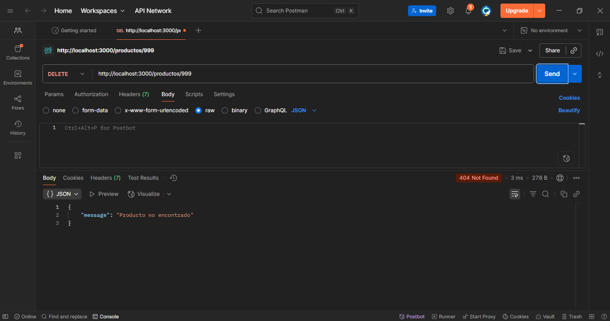

# API Node.js (Express) - Actividad

Este repositorio contiene la plantilla base para la actividad de APIs con Node.js y Express. El objetivo es completar los endpoints `PUT` y `DELETE` para gestionar una lista de productos.

## Prerrequisitos

Antes de comenzar, asegúrate de tener instalado lo siguiente:
- [Node.js](https://nodejs.org/) (versión 16 o superior recomendada).
- [npm](https://www.npmjs.com/) (incluido con Node.js).
- [Postman](https://www.postman.com/) o una herramienta similar (como cURL o Insomnia) para probar los endpoints.
- [Git](https://git-scm.com/) para clonar el repositorio.

## Guía de Inicio

1. **Clonar el repositorio**:
   ```bash
   git clone https://github.com/TU_USUARIO/api-nodejs-actividad.git
   cd api-nodejs-actividad
   ```
   Reemplaza `TU_USUARIO` con tu nombre de usuario de GitHub.

2. **Instalar dependencias**:
   Asegúrate de estar en el directorio del proyecto y ejecuta:
   ```bash
   npm install
   ```

3. **Ejecutar la API**:
   Inicia el servidor con nodemon:
   ```bash
   npm run dev
   ```
   O sino inicia el servidor con node:
   ```bash
   npm run start
   ```
   Los accesos direccion se pueden ver en el archivo `package.json` en la clave `script`
   La API estará disponible en `http://localhost:3000`.

## Estructura del Proyecto

```plaintext
api-nodejs-actividad/
├── server.js          # Archivo principal con la lógica de la API
├── package.json       # Dependencias y scripts del proyecto
├── screenshots/       # Carpeta con capturas de pantalla
└── README.md          # Este archivo
```

## Tarea

Implementa la lógica para los siguientes endpoints en `server.js`:
- **PUT /productos/:id**: Actualiza un producto existente según su ID. Debe validar que el producto exista y que los datos enviados sean válidos (e.g., `nombre` no vacío, `precio` numérico).
- **DELETE /productos/:id**: Elimina un producto según su ID. Debe devolver un mensaje de éxito o error si el producto no existe.

**Entrega**:
1. Completa los endpoints en `server.js`.
2. Crea un nuevo repositorio en tu cuenta de GitHub.
3. Sube tu código al repositorio (público o privado, según las instrucciones del instructor).
4. Envía el enlace del repositorio para su evaluación.

## Pruebas con Postman

### Configuración Inicial
Asegúrate de que el servidor esté corriendo en `http://localhost:3000` antes de realizar las pruebas.

### Endpoints Disponibles

#### 1. GET - Obtener todos los productos
- **Método**: `GET`
- **URL**: `http://localhost:3000/productos`
- **Headers**: No necesarios
- **Body**: No necesario

**Respuesta esperada (Status: 200)**:
```json
[
  { "id": 1, "nombre": "Laptop", "precio": 1200 },
  { "id": 2, "nombre": "Mouse", "precio": 25 },
  { "id": 3, "nombre": "Teclado", "precio": 75 }
]
```


#### 2. POST - Crear un nuevo producto
- **Método**: `POST`
- **URL**: `http://localhost:3000/productos`
- **Headers**: `Content-Type: application/json`
- **Body (raw JSON)**:
```json
{
  "id": 4,
  "nombre": "Monitor",
  "precio": 300
}
```

**Respuesta esperada (Status: 201)**:
```json
{
  "id": 4,
  "nombre": "Monitor",
  "precio": 300
}
```


#### 3. PUT - Actualizar un producto existente
- **Método**: `PUT`
- **URL**: `http://localhost:3000/productos/1`
- **Headers**: `Content-Type: application/json`
- **Body (raw JSON)**:
```json
{
  "nombre": "Laptop Gaming",
  "precio": 1500
}
```

**Respuesta esperada (Status: 200)**:
```json
{
  "message": "Producto actualizado con éxito",
  "data": {
    "id": 1,
    "nombre": "Laptop Gaming",
    "precio": 1500
  }
}
```


#### 4. DELETE - Eliminar un producto
- **Método**: `DELETE`
- **URL**: `http://localhost:3000/productos/3`
- **Headers**: No necesarios
- **Body**: No necesario

**Respuesta esperada (Status: 200)**:
```json
{
  "message": "Producto eliminado con éxito",
  "data": {
    "id": 3,
    "nombre": "Teclado",
    "precio": 75
  }
}
```


### Casos de Error

#### Error 404 - Producto no encontrado
- **Método**: Cualquiera (e.g., `GET`, `PUT`, `DELETE`)
- **URL**: `http://localhost:3000/productos/999`
- **Respuesta esperada (Status: 404)**:
```json
{
  "message": "Producto no encontrado"
}
```



## Configuración de Morgan

El proyecto usa [Morgan](https://www.npmjs.com/package/morgan) como middleware para registrar las peticiones HTTP en la consola. Esto es útil para depurar y verificar las solicitudes recibidas por el servidor.

**Ejemplo de salida en consola**:


